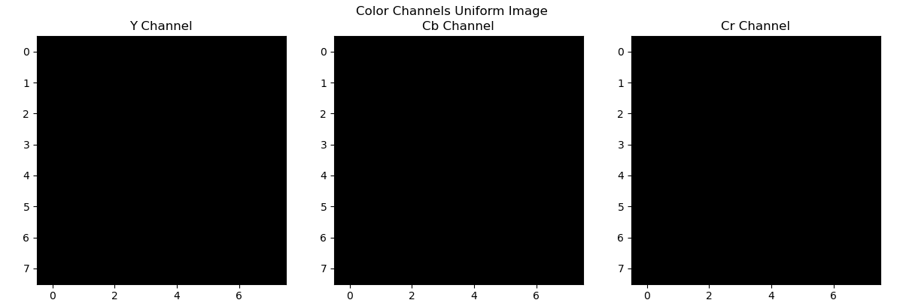
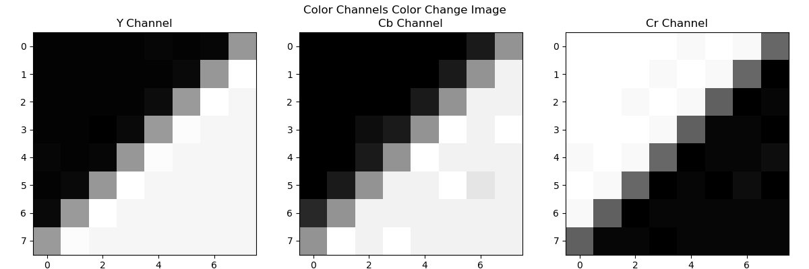

# JPEG ZigZag
## Steps:
1. Read image
2. Convert to YCbCr
3. Selection of the blocks (uniform and non-uniform)
4. Calculate the DCT in 2D for both blocks
5. It is ordered in zig-zag

## Processing

